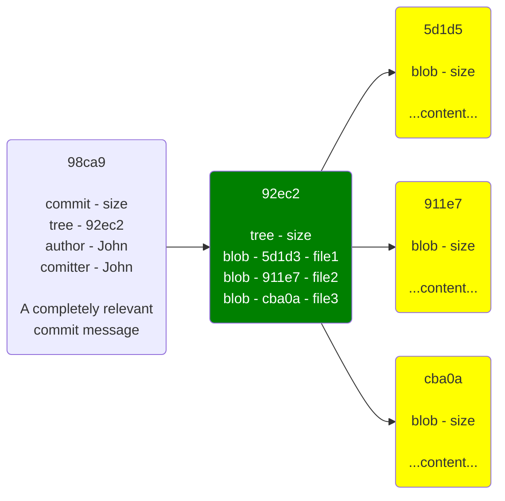
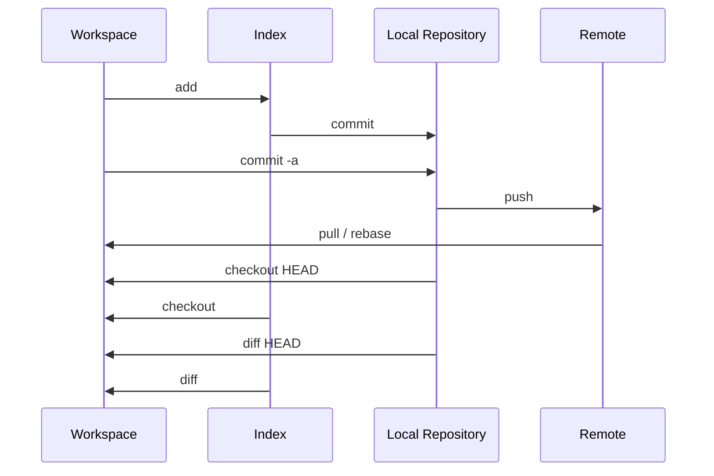

# GIT

## 1. What is it?

- **Git** is a distributed **version-control system** for tracking changes in source code during software development. It is designed for coordinating work among programmers, but it can be used to track changes in **any set of files**. Its goals include speed, data integrity, and support for distributed, non-linear workflows.

- **Git** was created by **Linus Torvalds** in 2005 for development of the Linux kernel, with other kernel developers contributing to its initial development. Its current maintainer since 2005 is **Junio Hamano**. As with most other distributed version-control systems, and unlike most client–server systems, **every Git directory** on **every computer** is a **full-fledged repository** with complete history and full version-tracking abilities, independent of network access or a central server. Git is free and open-source software distributed under the terms of the GNU General Public License version 2.

Read more on https://en.wikipedia.org/wiki/Git

---

## 2. How GIT stores data

- Git doesn’t store data as a series of **changesets** or differences, but instead as a series of **snapshots**.

- When you make a **commit**, Git stores a **commit object** that contains **a pointer** to the **snapshot** of the content you staged. This object also contains the author’s name and email address, the message that you typed, and **pointers** to the **commit or commits** that directly came **before** this commit (its parent or parents): zero parents for the initial commit, one parent for a normal commit, and multiple parents for a commit that results from a merge of two or more branches.

### 2.1 What is a commit

- When you create the commit by running **git commit**, Git checksums each subdirectory and stores them as a **tree object** in the Git repository. Git then creates a **commit object** that has the metadata and a pointer to the root project tree so it can re-create that **snapshot** when needed.

- If you make some changes and commit again, the next commit stores a pointer to the commit that came immediately before it.

### 2.2 Labels (pointers)

- A **branch** in Git is simply a lightweight movable **pointer** to one of these commits. The default branch name in Git is master. Every time you commit, the branch pointer moves forward automatically.

---

## 4. Transport commands

